# 🧠 RAG System — Production-Ready Retrieval-Augmented Generation

<div align="center">


**An enterprise-grade Retrieval-Augmented Generation system for intelligent document Q&A with semantic search, neural reranking, and AI-powered answers with citations.**

🔗 **[Live Demo](https://rag-system-2mps.onrender.com)** | 📖 **[API Documentation](#-api-endpoints)** | 🚀 **[Quick Start](#-quick-start)**

</div>

---

## 📋 Table of Contents

- [Overview](#-overview)
- [Key Features](#-key-features)
- [System Architecture](#-system-architecture)
- [RAG Pipeline Deep Dive](#-rag-pipeline-deep-dive)
- [Database Design](#-database-design-supabase--pgvector)
- [Technical Highlights](#-technical-highlights-interview-talking-points)
- [API Endpoints](#-api-endpoints)
- [Project Structure](#-project-structure)
- [Technology Stack](#-technology-stack)
- [Quick Start](#-quick-start)
- [Environment Variables](#-environment-variables)
- [Deployment](#-deployment)

---

## 🌟 Overview

This project implements a **complete RAG (Retrieval-Augmented Generation) pipeline** from scratch, demonstrating advanced concepts in:

- **Vector Databases & Semantic Search** — Using pgvector extension for high-dimensional similarity search
- **Embedding Models** — Cohere's state-of-the-art `embed-english-v3.0` (1024 dimensions)
- **Neural Reranking** — Two-stage retrieval with Cohere's `rerank-english-v3.0`
- **LLM Integration** — Google Gemini 2.5 Flash for context-aware answer generation
- **Production Best Practices** — Deduplication, batch processing, caching, and error handling

### Why RAG?

Traditional LLMs have knowledge cutoffs and can hallucinate. RAG solves this by:
1. **Grounding responses** in your actual documents
2. **Providing citations** for every claim
3. **Enabling real-time updates** without model retraining

---

## ✨ Key Features

| Feature | Description | Technical Implementation |
|---------|-------------|-------------------------|
| 📄 **Multi-Format Upload** | Supports PDF and TXT files | PyMuPDF for PDF extraction, UTF-8 decoding for text |
| 🔍 **Semantic Search** | Find relevant content by meaning, not keywords | Cohere embeddings + pgvector cosine similarity |
| 🎯 **Neural Reranking** | Precision results with cross-encoder | Cohere Rerank v3.0 for semantic relevance scoring |
| 🤖 **AI Answers** | Context-aware responses with citations | Gemini 2.5 Flash with structured prompting |
| 🔐 **Deduplication** | Prevents duplicate document uploads | SHA-256 content hashing |
| 📊 **Real-time Stats** | Live document and chunk counts | Supabase real-time queries |
| ⚡ **Batch Processing** | Fast ingestion of large documents | Batch embeddings (96 texts/call) |
| 🧹 **Smart Chunking** | Overlapping token-based chunks | tiktoken with 800 tokens, 120 overlap |

---

## 🏗️ System Architecture

### High-Level Architecture Diagram

```mermaid
flowchart TB
    subgraph Client["🖥️ Frontend (HTML/CSS/JS)"]
        UI[Web Interface]
        Upload[File Upload]
        Chat[Chat Interface]
    end
    
    subgraph Server["⚡ FastAPI Backend"]
        API[REST API Layer]
        Chunking[Chunking Engine<br/>tiktoken]
        RAG[RAG Pipeline]
        PDF[PDF Processor<br/>PyMuPDF]
    end
    
    subgraph AI["🤖 AI Services"]
        Embed[Cohere Embed<br/>embed-english-v3.0]
        Rerank[Cohere Rerank<br/>rerank-english-v3.0]
        LLM[Google Gemini<br/>2.5 Flash]
    end
    
    subgraph DB["🗄️ Supabase"]
        PG[(PostgreSQL)]
        Vector[pgvector Extension]
        Docs[documents table]
        Meta[ingested_documents table]
    end
    
    UI --> API
    Upload --> API
    Chat --> API
    
    API --> Chunking --> Embed
    API --> PDF --> Chunking
    API --> RAG
    
    Embed --> Vector --> Docs
    RAG --> Vector
    RAG --> Rerank --> LLM
    
    LLM --> Chat
    
    Docs --> Meta
```



### Query Flow Diagram


### Document Ingestion Flow


---

## 🔬 RAG Pipeline Deep Dive

### Stage 1: Document Ingestion & Chunking


**Chunking Strategy:**
```python
# Uses tiktoken (cl100k_base) for consistent token counting
chunk_size = 800 tokens   # Optimal for context window
overlap = 120 tokens      # 15% overlap for context continuity
```

**Why This Matters:**
- **800 tokens** balances context richness vs. retrieval precision
- **120 token overlap** ensures no information is lost at chunk boundaries
- **tiktoken** uses the same tokenizer as GPT models for accurate counting

### Stage 2: Semantic Search & Retrieval


**Two-Stage Retrieval:**
1. **Broad Recall**: Retrieve 25 candidates via vector similarity
2. **Precision Filtering**: Deduplicate + source diversity + reranking

### Stage 3: Neural Reranking


**Why Reranking?**
- Vector search uses **bi-encoders** (fast but approximate)
- Reranking uses **cross-encoders** (slower but precise)
- Cross-encoders see query + document together for true relevance

### Stage 4: Answer Generation

```python
# Structured prompt for Gemini
RULES:
1. Use ONLY information from sources
2. Every claim needs citation [1], [2], etc.
3. No repeated information
4. Explicitly state if insufficient info
5. Never hallucinate
```

---

## 🗄️ Database Design (Supabase + pgvector)

### Entity Relationship Diagram


### Schema Details

#### `documents` Table — Vector Storage

```sql
CREATE TABLE documents (
  id uuid PRIMARY KEY DEFAULT gen_random_uuid(),
  content text,                          -- Raw chunk text
  embedding vector(1024),                -- Cohere embed-english-v3.0
  source text,                           -- Source file reference
  chunk_index int DEFAULT 0,             -- Position in source
  created_at timestamptz DEFAULT now()
);

-- IVFFlat index for approximate nearest neighbor search
CREATE INDEX ON documents 
  USING ivfflat (embedding vector_cosine_ops) 
  WITH (lists = 100);
```

**Index Strategy — IVFFlat:**
- **100 lists** partitions vectors into clusters
- **Trade-off**: Slightly reduced accuracy for ~10x faster search
- **Ideal for**: 10K-1M vectors (scales well)

#### `ingested_documents` Table — Deduplication Registry

```sql
CREATE TABLE ingested_documents (
  id uuid PRIMARY KEY DEFAULT gen_random_uuid(),
  content_hash text UNIQUE NOT NULL,     -- SHA-256 for dedup
  source_name text,                      -- Human-readable name
  chunk_count int,                       -- Chunks generated
  created_at timestamptz DEFAULT now()
);
```

### Vector Search Function

```sql
CREATE FUNCTION match_documents(
  query_embedding vector(1024),
  match_threshold float,
  match_count int
) RETURNS TABLE (
  id uuid,
  content text,
  source text,
  chunk_index int,
  similarity float
) AS $$
BEGIN
  RETURN QUERY
  SELECT
    documents.id,
    documents.content,
    documents.source,
    documents.chunk_index,
    1 - (documents.embedding <=> query_embedding) AS similarity
  FROM documents
  WHERE 1 - (documents.embedding <=> query_embedding) > match_threshold
  ORDER BY documents.embedding <=> query_embedding
  LIMIT match_count;
END;
$$ LANGUAGE plpgsql;
```

**Key Points:**
- Uses **cosine distance** operator `<=>`
- Converts to similarity: `1 - distance`
- Filters by threshold before sorting (efficient)

---

## 🎯 Technical Highlights (Interview Talking Points)

### 1. **Two-Stage Retrieval with Neural Reranking**
```
Vector Search (Recall) → Deduplication → Source Grouping → Cross-Encoder Reranking (Precision)
```
- Retrieves 25 candidates, deduplicates, returns top 5
- Cross-encoder reranking improves precision by 15-30%

### 2. **Intelligent Chunking Strategy**
```python
# tiktoken-based chunking with overlap
chunk_size=800, overlap=120  # 15% overlap ratio
```
- Token-based (not character) for LLM compatibility
- Overlap prevents context loss at boundaries

### 3. **Batch Processing for Performance**
```python
def embed_texts_batch(texts, batch_size=96):
    # Cohere supports up to 96 texts per API call
    # Reduces latency by ~10x vs individual calls
```

### 4. **Content-Addressable Deduplication**
```python
content_hash = hashlib.sha256(text.encode('utf-8')).hexdigest()
```
- SHA-256 ensures unique content identification
- Prevents re-processing identical documents

### 5. **Dual Embedding Types**
```python
# Document embeddings
input_type="search_document"

# Query embeddings  
input_type="search_query"
```
- Cohere uses asymmetric embeddings for better retrieval
- Queries and documents are embedded differently for optimal matching

### 6. **Source Diversity in Results**
```python
def group_by_source(chunks, max_per_source=2):
    # Prevents answer domination by single document
```

### 7. **Compressed Citations for UX**
```python
def compress_citation(text, max_chars=350):
    # Truncates at word boundary for clean display
    return text[:max_chars].rsplit(' ', 1)[0] + "..."
```

### 8. **Jaccard-Based Deduplication**
```python
# Fast set-based overlap detection
overlap = len(set(chunk1.split()) & set(chunk2.split()))
total = len(set(chunk1.split()) | set(chunk2.split()))
similarity = overlap / total  # Jaccard index
```

### 9. **Structured Prompting for Reliability**
```python
prompt = """
RULES:
1. Use ONLY information from sources
2. Every claim needs citation [1], [2]
3. No repeated information
4. Explicitly state if insufficient info
5. Never use outside knowledge
"""
```

### 10. **Production-Ready Error Handling**
```python
try:
    results = co.rerank(...)
except Exception as e:
    print(f"Reranking failed: {e}")
    return grouped[:top_n]  # Graceful fallback
```

---

## 🔌 API Endpoints

| Method | Endpoint | Description | Request Body |
|--------|----------|-------------|--------------|
| `GET` | `/health` | Health check | - |
| `GET` | `/stats` | Document/chunk counts | - |
| `POST` | `/ingest` | Ingest text content | `{text, source}` |
| `POST` | `/ingest-file` | Upload PDF/TXT file | `FormData` |
| `POST` | `/query` | Ask a question | `{query}` |
| `POST` | `/open` | Open local file | `{path}` |

### Example Requests

```bash
# Health Check
curl http://localhost:8000/health

# Upload File
curl -X POST -F "file=@document.pdf" http://localhost:8000/ingest-file

# Ask Question
curl -X POST -H "Content-Type: application/json" \
  -d '{"query": "What are the key points?"}' \
  http://localhost:8000/query
```

---

## 📂 Project Structure

```
mini-rag/
├── backend/
│   ├── main.py           # FastAPI app, routes, CORS, middleware
│   ├── rag.py            # RAG pipeline: embed → search → rerank → generate
│   ├── db.py             # Supabase client, embeddings, CRUD operations
│   ├── chunking.py       # Token-based text chunking with overlap
│   ├── reranker.py       # Deduplication, source grouping, Cohere rerank
│   ├── pdf_utils.py      # PDF text extraction with PyMuPDF
│   ├── schema.sql        # PostgreSQL + pgvector schema definitions
│   └── requirements.txt  # Python dependencies
├── frontend/
│   ├── index.html        # Single-page app with embedded CSS
│   ├── script.js         # API calls, UI interactions, chat interface
│   ├── style.css         # Additional styles
│   └── background.js     # Galaxy background animation
├── Dockerfile            # Multi-stage Docker build
├── render.yaml           # Render.com deployment config
└── README.md             # This file
```

---

## 🛠️ Technology Stack

### Backend
| Technology | Purpose | Why Chosen |
|------------|---------|------------|
| **FastAPI** | API Framework | Async support, auto-docs, type hints |
| **Python 3.11** | Runtime | Latest features, performance improvements |
| **Pydantic** | Validation | Request/response schema validation |
| **tiktoken** | Tokenization | Accurate token counting for LLMs |
| **PyMuPDF** | PDF Processing | Fast, reliable text extraction |

### AI/ML Services
| Service | Purpose | Why Chosen |
|---------|---------|------------|
| **Cohere embed-english-v3.0** | Embeddings | 1024D, state-of-the-art retrieval |
| **Cohere rerank-english-v3.0** | Reranking | Cross-encoder precision |
| **Google Gemini 2.5 Flash** | LLM | Fast, accurate, cost-effective |

### Database
| Technology | Purpose | Why Chosen |
|------------|---------|------------|
| **Supabase** | Backend-as-a-Service | PostgreSQL + realtime + auth |
| **pgvector** | Vector Extension | Native Postgres vector operations |
| **IVFFlat Index** | ANN Search | 10x faster than brute force |

### Frontend
| Technology | Purpose |
|------------|---------|
| **Vanilla JS** | No framework overhead |
| **Marked.js** | Markdown rendering |
| **Inter Font** | Clean typography |

### DevOps
| Technology | Purpose |
|------------|---------|
| **Docker** | Containerization |
| **Render.com** | Cloud deployment |

---

## 🚀 Quick Start

### Prerequisites
- Python 3.11+
- Supabase account (free tier works)
- Cohere API key (free tier: 1000 calls/month)
- Google AI API key (Gemini)

### 1. Clone & Install

```bash
git clone https://github.com/yourusername/mini-rag.git
cd mini-rag/backend
pip install -r requirements.txt
```

### 2. Database Setup

Run in Supabase SQL Editor:
```sql
-- Enable vector extension
CREATE EXTENSION IF NOT EXISTS vector;

-- Create tables (see schema.sql for full script)
```

### 3. Environment Variables

Create `backend/.env`:
```env
GEMINI_API_KEY=your_gemini_key
COHERE_API_KEY=your_cohere_key
SUPABASE_URL=https://your-project.supabase.co
SUPABASE_KEY=your_supabase_anon_key
```

### 4. Run Locally

```bash
cd backend
uvicorn main:app --reload --port 8000
```

Visit: `http://localhost:8000`

---

## 🔐 Environment Variables

| Variable | Description | Required |
|----------|-------------|----------|
| `GEMINI_API_KEY` | Google AI API key for Gemini | ✅ |
| `COHERE_API_KEY` | Cohere API key for embeddings & reranking | ✅ |
| `SUPABASE_URL` | Supabase project URL | ✅ |
| `SUPABASE_KEY` | Supabase anon/public key | ✅ |

---

## 🐳 Deployment

### Docker

```bash
docker build -t rag-system .
docker run -p 8000:8000 --env-file backend/.env rag-system
```

### Render.com

1. Connect GitHub repo
2. Select Docker environment
3. Add environment variables
4. Deploy!

Configuration in `render.yaml` handles everything automatically.

---

## 📈 Performance Metrics

| Metric | Value |
|--------|-------|
| Chunk Size | 800 tokens |
| Embedding Dimensions | 1024 |
| Retrieval Candidates | 25 |
| Final Results | 5 |
| Batch Size | 96 texts/call |
| Index Type | IVFFlat (100 lists) |

---

## 🔮 Future Enhancements

- [ ] Hybrid search (BM25 + vector)
- [ ] Multi-modal support (images)
- [ ] Conversation memory
- [ ] Document versioning
- [ ] User authentication
- [ ] Analytics dashboard

---


---

<div align="center">

**Built with ❤️ for learning and production use**

*If this helped you, consider giving it a ⭐!*

</div>
